<!-- ===== THEME-AWARE HERO ===== -->
<picture>
  <source
    media="(prefers-color-scheme: dark)"
    srcset="https://raw.githubusercontent.com/dpsychoo/dpsychoo/main/dark.svg">
  <source
    media="(prefers-color-scheme: light)"
    srcset="https://raw.githubusercontent.com/dpsychoo/dpsychoo/main/light.svg">
  
</picture>

<!-- ===== GITHUB STATS ===== -->

  <picture>
    <source
      media="(prefers-color-scheme: dark)"
      srcset="https://streak-stats.demolab.com/?user=dpsychoo&amp;background=0A101F&amp;stroke=22D3EE&amp;ring=A78BFA&amp;fire=10B981&amp;currStreakLabel=22D3EE&amp;sideLabels=94A3B8&amp;currStreakNum=F8FAFC&amp;sideNums=F8FAFC&amp;dates=64748B&amp;hide_border=true">
    <source
      media="(prefers-color-scheme: light)"
      srcset="https://streak-stats.demolab.com/?user=dpsychoo&amp;background=FFFFFF&amp;stroke=0891B2&amp;ring=7C3AED&amp;fire=059669&amp;currStreakLabel=0891B2&amp;sideLabels=475569&amp;currStreakNum=0F172A&amp;sideNums=0F172A&amp;dates=94A3B8&amp;hide_border=true">
    
  </picture>
   
  <picture>
    <source
      media="(prefers-color-scheme: dark)"
      srcset="./profile/stats-dark.svg">
    <source
      media="(prefers-color-scheme: light)"
      srcset="./profile/stats-light.svg">
    
  </picture>
  <picture>
    <source
      media="(prefers-color-scheme: dark)"
      srcset="./profile/languages-dark.svg">
    <source
      media="(prefers-color-scheme: light)"
      srcset="./profile/languages-light.svg">
    
  </picture>

<!-- ===== CONTRIBUTION SNAKE ===== -->
<picture>
  <source
    media="(prefers-color-scheme: dark)"
    srcset="https://raw.githubusercontent.com/dpsychoo/dpsychoo/output/snake-dark.svg?v=2">
  <source
    media="(prefers-color-scheme: light)"
    srcset="https://raw.githubusercontent.com/dpsychoo/dpsychoo/output/snake-light.svg?v=2">
  
</picture>
<!-- ===== PROJECTS ===== -->
<picture>
  <source
    media="(prefers-color-scheme: dark)"
    srcset="https://raw.githubusercontent.com/dpsychoo/dpsychoo/projects/projects.svg">
  <source
    media="(prefers-color-scheme: light)"
    srcset="https://raw.githubusercontent.com/dpsychoo/dpsychoo/projects/projects-light.svg">
  
</picture>
<!-- ===== SOCIAL BADGES ===== -->

   
  &#160;&#160;
  &#160;&#160;
  &#160;&#160;
  

